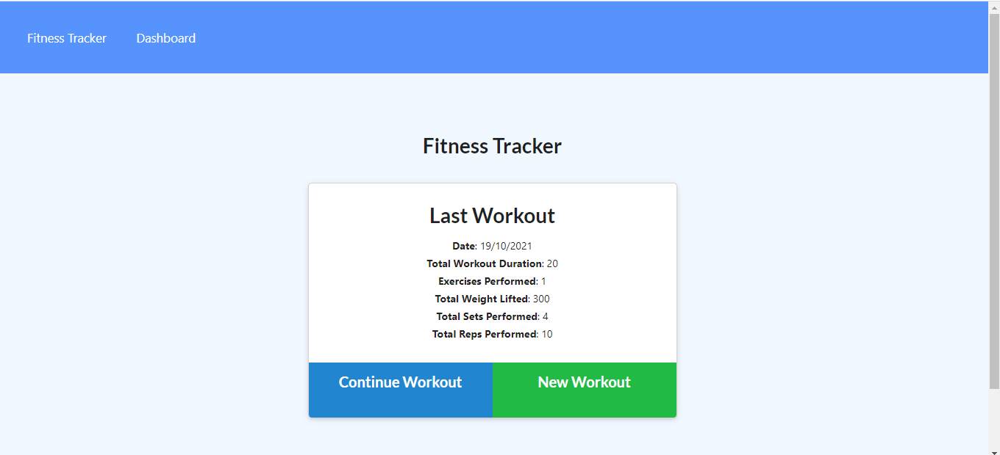
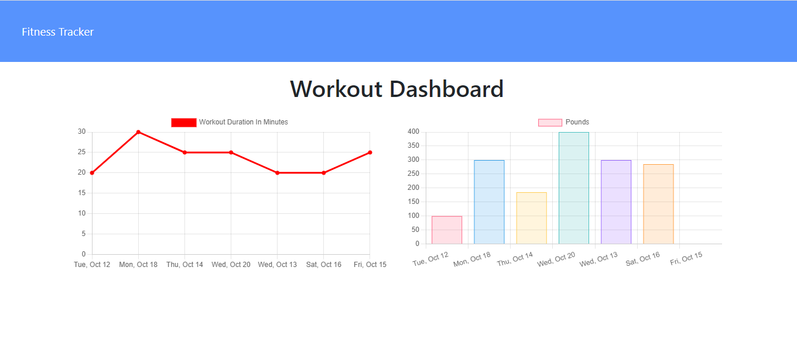
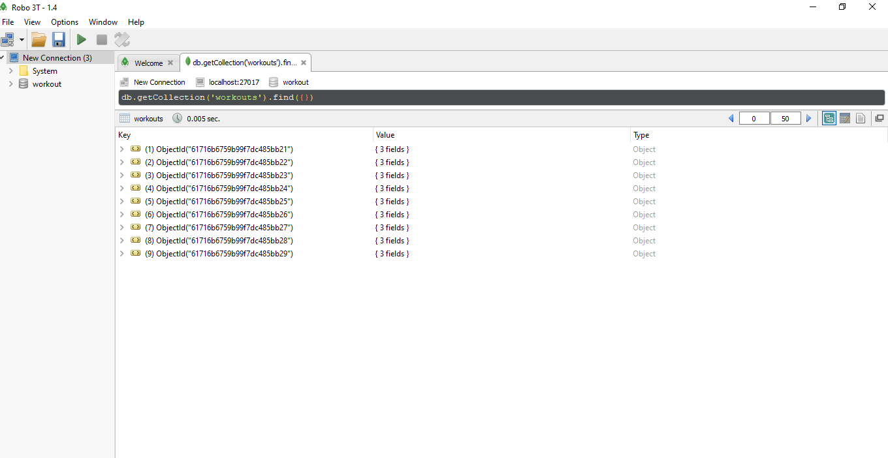

# NoSql-Workout-Tracker


[](https://opensource.org/licenses/MIT)

### Table of Contents

- [Description](#description)
- [Installation](#installation)
- [Usage](#usage)
- [Application Image](#application-image)
- [Contributing](#contributing)
- [Testing](#testing)
- [Questions](#questions)


## Description

Full stack application which allows users to input thier most recent workouts and the exercises they performed during them. Excercises are divided into resistance training and cardio, the actual name of each exercise is inputed by the user. The workout information is stored in a ```MongoDB``` database through the use of a ```mongoose schema```


## Installation

1. Clone the above repo to your machine

2. Run `npm i` to install your dependencies 

3. Populate your `MongoDB database` by uncommenting the required seed file
or by running `npm run seed`

4. Run `node server.js` or `npm start` to run the server at which point you connect to your local host and then you can use the application. 


## Usage

Once the application loads in the browser you can either click the dashboard page to view the workout stats on the graphs provided OR you can update a new workout on the home page.

When adding a new workout be sure to fill in all the input fields and then click complete once done, the application will then add a blank instance of the workout with 0 for the numbers and no string for title/name area.


## Application Image 

 

  

  

 

## Credits

If you want to contribute please create and issue or pull-request and I will get back to you as soon as possible.

## Questions

If you have any questions feel free to contact me here:

 ##### Github: [github.com/mus-ali1](https://github.com/mus-ali1)
 

 ##### Email: [mustafa_a_ali@outlook.com](mailto:mustafa_a_ali@outlook.com?subject=[GitHub])

## Testing

No testing available at this moment.
